## Running locally

1. Clone the project from github
2. open terminal and cd deployment/docker
3. Setup the following services and get the corresponding keys
   - Create an account on mongodb atlas, create a cluster, db and get a mongo srv string
   - Setup cloudinary account and get your account name
   - Setup Strip developer account and get Strip secret key.
4. Run the exports to set in the terminal

   ```
   export MONGO_SRV=<YOUR MONGO SRV>

   export JWT_SECRET="notsosecret"

   export CLOUDINARY_URL="https://api.cloudinary.com/v1_1/<YOUR ACCOUNT NAME>/image/upload"

   export  STRIPE_SECRET_KEY=<YOUR STRIPE SECRET KEY>

   export PORT=8080

   export NODE_ENV=production

   export CLOUDWATCH_GROUP_NAME=ecommerce-store

   export CLOUDWATCH_ACCESS_KEY=<ACCESS_KEY_ID>

   export CLOUDWATCH_SECRET_ACCESS_KEY=<ACCESS_KEY_SECRET>

   export CLOUDWATCH_REGION=us-east-1

   ```

5. Run the docker compose build

```docker
docker-compose -f docker-compose-build.yaml build --parallel
```

6. Run docker compose up command to start the containers.

```docker
docker-compose up
```

## Running in Production

1. Create a EKS Cluster in the AWS Console with name ecommerce-app.
   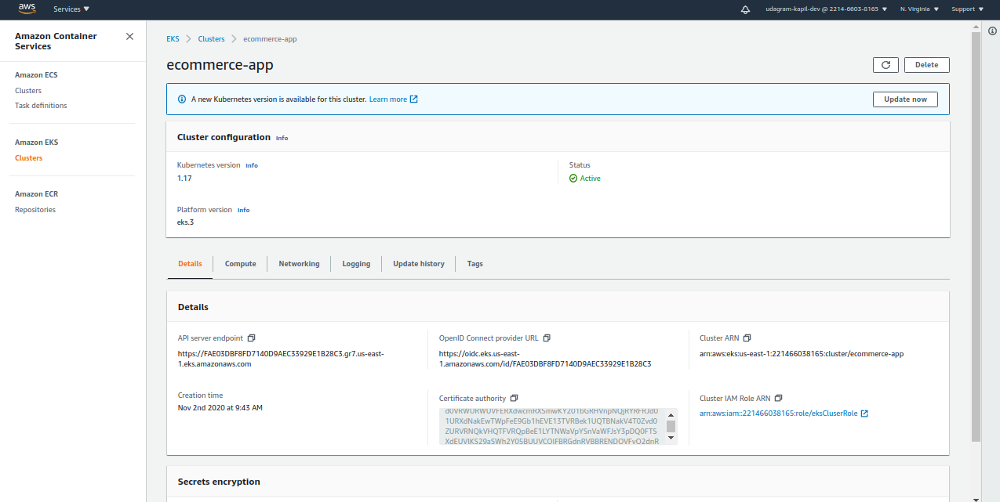

2. Configure EKS Cluster using AWS cli and check as shown in image below.

```js
  aws eks --region us-east-1 update-kubeconfig --name ecommerce-app
```

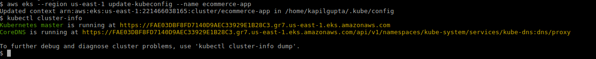

3. Check the cluster info using below command as shown in image above.

```js
  kubectl cluster-info
```

4. Add a nodegroup to the EKS cluster using the "Add Node Group" section in the "Compute" tab

- 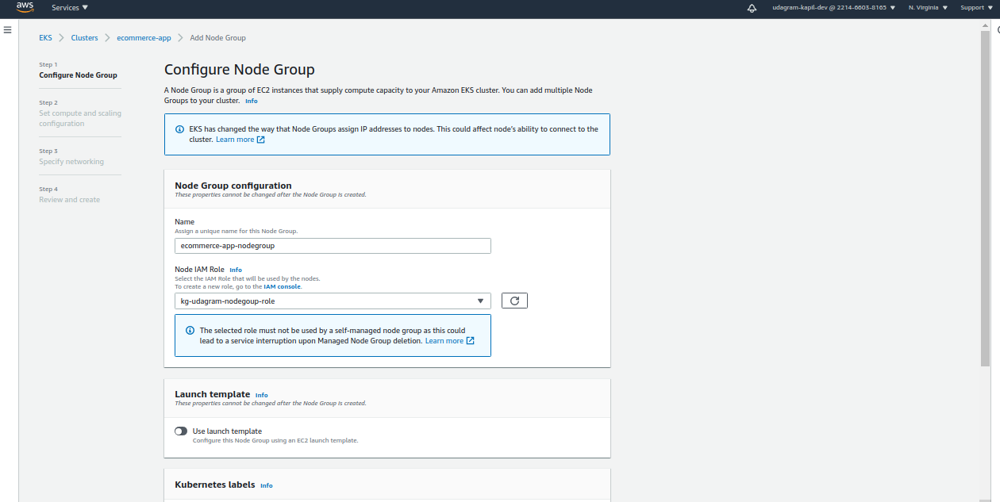
- 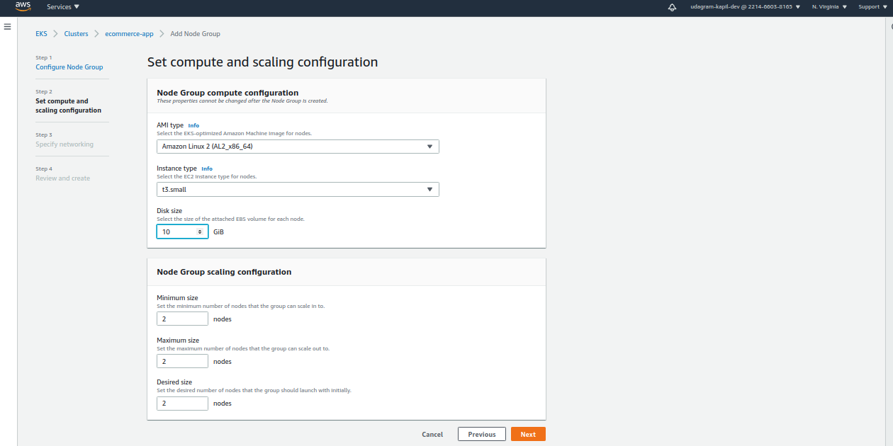
- 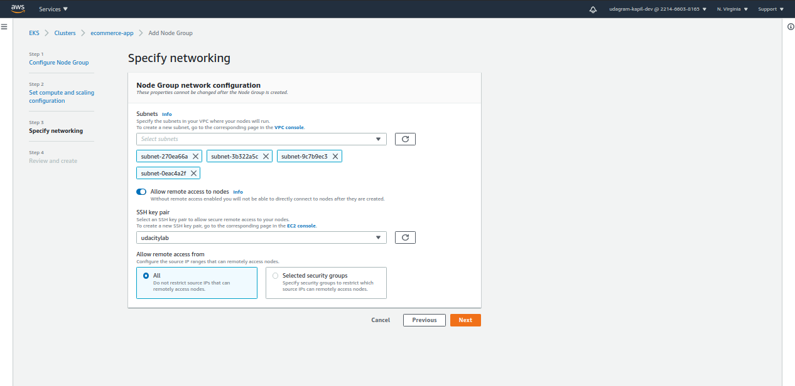
- 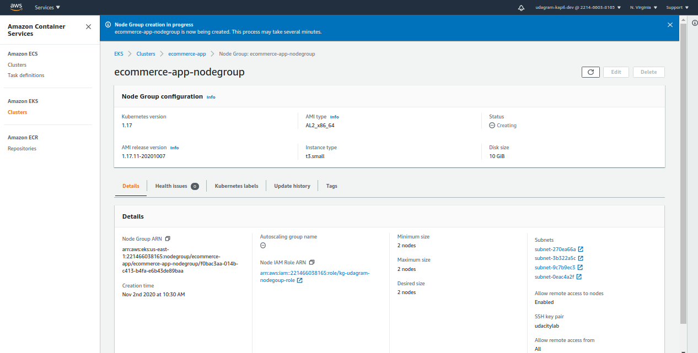

5. Refresh the AWS page to check the node group is created.
6. Once node group is created check the status of nodes in cluster using following command

```js
  kubectl get nodes
```

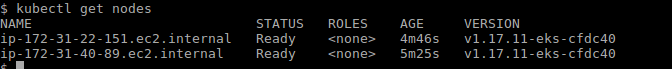

7. Create k8 Secrets and ConfigMap

```js
  kubectl apply -f env-secret.yaml
  kubectl apply -f env-configmap.yaml
```

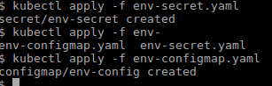

8. Apply Backend Deployment and Service yaml

```js
  kubectl apply -f backend-deployment.yaml
  kubectl apply -f backend-service-lb.yaml
```

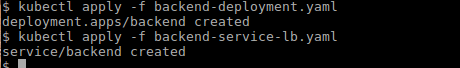

9. Check the status of Backend pods

```js
  kubectl get pods
```

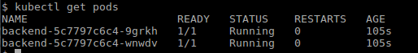

10. Check the status of Backend services

```js
  kubectl get services
```

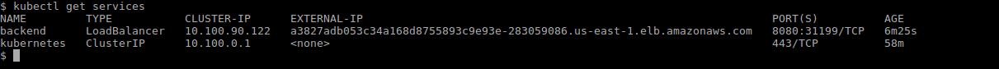

11. Verify the backend api's are working fine using the loadbalancer host

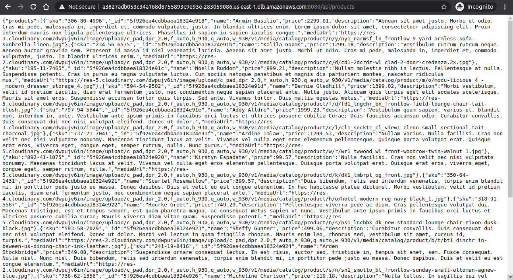

12. Update the next.config.js file in the config with the loadbalanced backend service url.

```js
// must restart server whenever you make changes in next.config
module.exports = {
  serverRuntimeConfig: {
    // Will only be available on the server side
    apiUrl: `http://a3827adb053c34a168d8755893c9e93e-283059086.us-east-1.elb.amazonaws.com:8080`,
  },
  publicRuntimeConfig: {
    // Will be available on both server and client
    apiUrl: `http://a3827adb053c34a168d8755893c9e93e-283059086.us-east-1.elb.amazonaws.com:8080`,
  },
};
```

13. Commit the changes to trigger the new Frontend build and image creation.

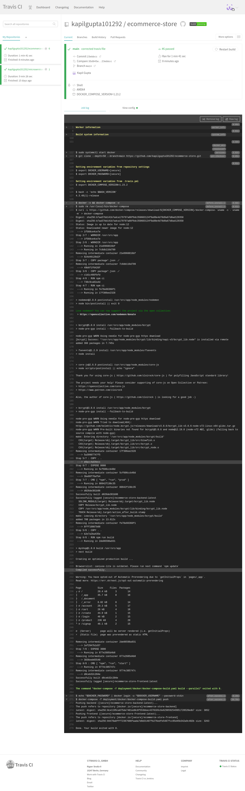

14. Check the Docker hub has the latest images.

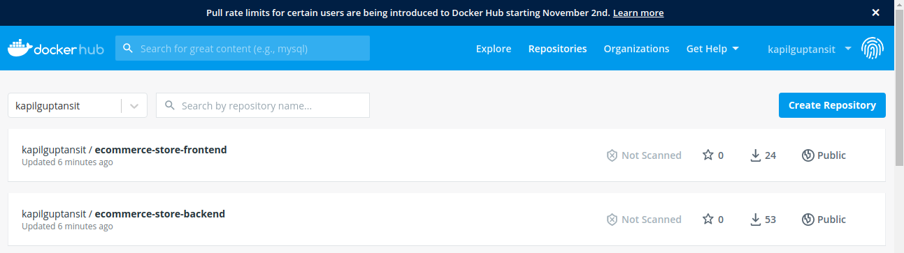 14. Apply Frontend Deployment and Service yaml

15. Create Deployment and Service for the frontend server.

```js
  kubectl apply -f frontend-deployment.yaml
  kubectl apply -f frontend-service-lb.yaml
```

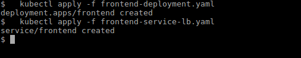

16. Check the status of Frontend pods

```js
  kubectl get pods
```

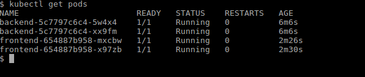

17. Check the status of Frontend services

```js
  kubectl get services
```

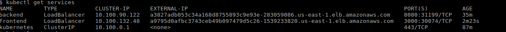

18. Check whether you are able to access the application in the browser using the frontend service url.
    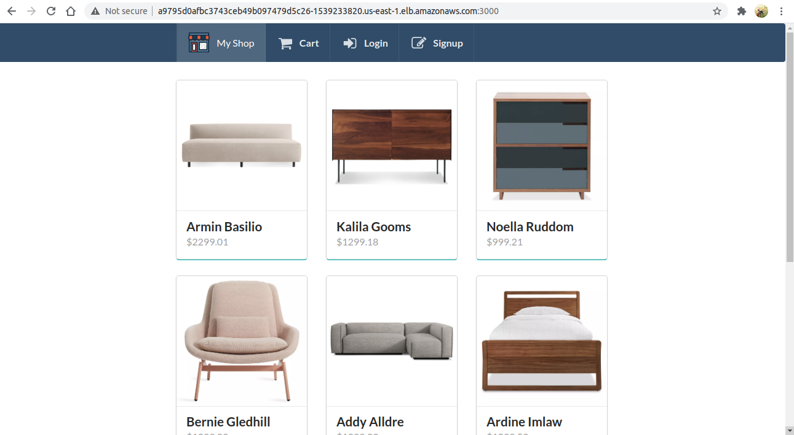
19. Verify Logs
    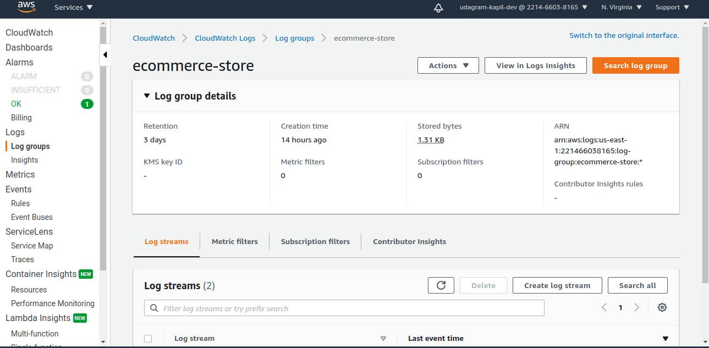
    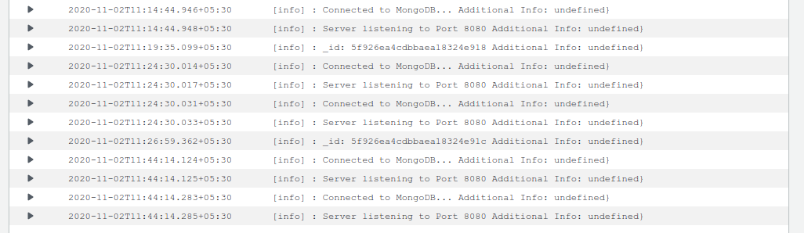
